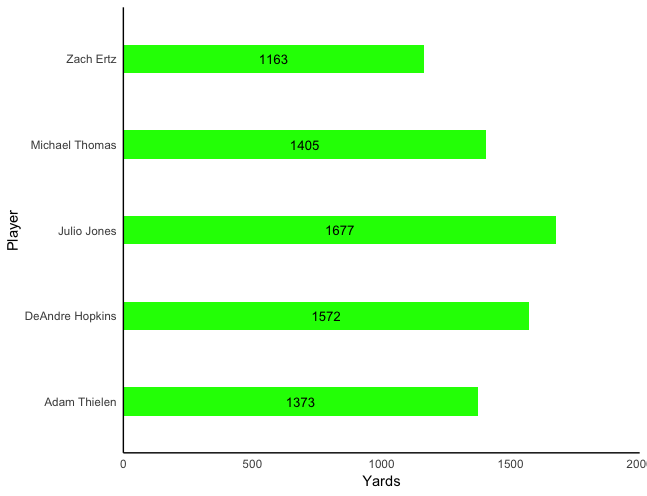

Horizontal Bar Chart (STATA)

```r
input str30 player	make miss   
"Luke Kennard"	60.00	40.00
"Tyreke Evans"	55.00	45.00 
"JaMychal Green"	52.20	47.80 
"Shai Gilgeous" 50.00	50.00 
"Bryn Forbes" 48.4 51.6 .
end

graph hbar make miss, over(player, sort(make) desc label(angle(0) labs(small))) ///
intensity(*.75) lintensity(255) name(Q12_13, replace) stack /// 
title("{bf:Proportion of 3pt Field Goals made}", size(small) pos(11) span) ///
subtitle("{it:Top 9 NBA Players:}" /// 
, size(small) pos(11) span) ///
ytitle("3-Point Percentage", size(vsmall)) ///
yscale(r(0 105)) ylabel(0(10)100, angle(0) labs(vsmall)) /// 
blabel(bar, position(center) format(%3.1f) color(gs1) size(vsmall)) ///
legend(label(1 "3pt FG Made") label(2 "3pt FG Missed") ///
region(lpattern(blank)) size(vsmall) symxsize(5) col(5) ring(1) position(12) span) ///
scheme(burd5) ///
caption("{bf:SOURCE}: NBA.com ", size(vsmall) pos(7) span) 
```
<center>

</center>


Iowa Map (R)

```r
#slots by subregion
slots_ia <- ia_base + 
  geom_polygon(data = Iowa.data, aes(fill = slots.total ), color = "white") +
  geom_polygon(color = "black", fill = NA) +
  theme_bw() +
  ditch_the_axes 

#adding some color 
IOWAslots <-  slots_ia + scale_fill_gradientn(colours = RColorBrewer::brewer.pal(9, "YlGn"),
                                   breaks = c(0.001,0.010,0.100),
                                   trans = "log10")

#family poverty in county vs state family poverty ratio
fam_pov_ia <- ia_base + 
  geom_polygon(data = Iowa.data, aes(fill = pov.rel.state ), color = "white") +
  geom_polygon(color = "black", fill = NA) +
  theme_bw() +
  ditch_the_axes

#adding some color
fam_pov_ia <- fam_pov_ia + scale_fill_gradientn(colours = rev(heat.colors(15)), 
                                          breaks = c(.6, .8, 1.0,1.2,1.4,1.6))
```
<center>

</center>

<center>

</center>

Horizontal Bar Chart (R)
```r
p <- ggplot(x18, aes(x=Player, y= Rec_Yards)) +
  geom_col(width = .33, fill = "Green") +
  coord_flip() + 
  ylab("Yards") +
  xlab("Player") + 
  theme_minimal() +
  theme(panel.border = element_blank(), panel.grid.major = element_blank(),
        panel.grid.minor = element_blank(), axis.line = element_line(colour = "black")) +
  scale_y_continuous(expand = c(0, 0), limits = c(0, 2000)) + 
  geom_text(data=x18, aes(label=Rec_Yards, y=Rec_Yards/2), colour="black", size=3.5)

p
```
<center>

</center>

