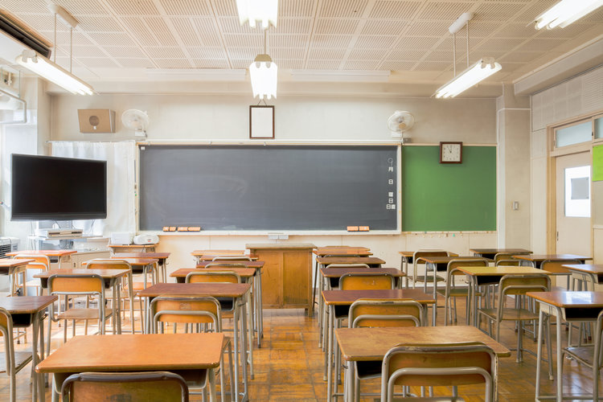

I consider it a great honor as well as responsibility to be intimately involved in the work of fashioning impressionable young minds. It is my belief that minds are best developed when students participate in intellectual exchanges with peers that hold diverse social, cultural, religious, and political ideals. In a world in which many topics are divisive, it is necessary to establish classroom conditions that promote respect and thus allow students to participate in such critical exchanges.

To this end, in my classroom, I model the importance of listening, the importance of respectful communication, and I argue that our reflexive pursuit of consensus when confronted with dissenting opinions is often unnecessary (i.e., the classroom is a safe space for respectful disagreement). I encourage my students to think globally about the problems at hand, challenge previously held beliefs considering new evidence, and employ creative strategies to produce solutions to real-world problems. The focus of my teaching philosophy is to furnish students with three core competencies. If I am successful, my students will learn to acquire defensible knowledge, apply knowledge, and work in a collaborative environment. 